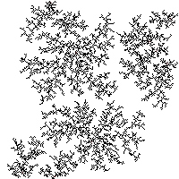
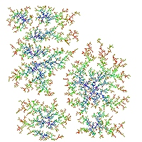
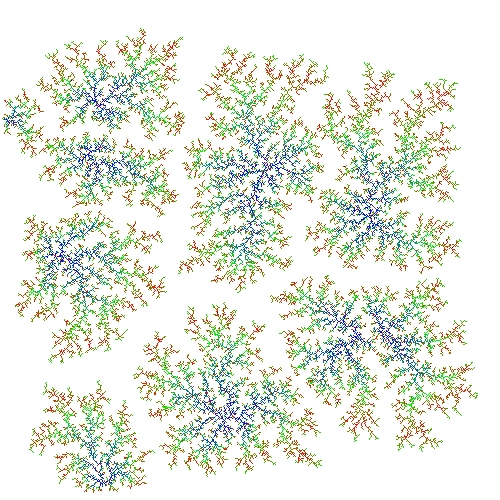
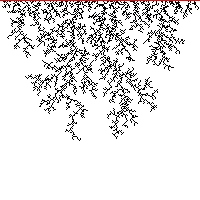
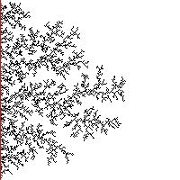
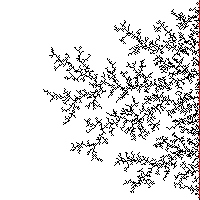
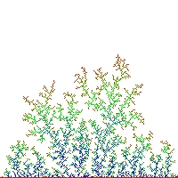
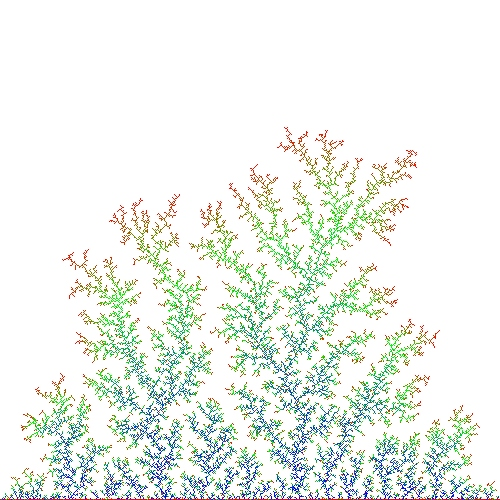

# Diffusion Limited Aggregation

## command line

```
  -w, --width arg       image width (default: 200)
  -h, --height arg      image height (default: 200)
  -i, --iterations arg  number of simulation iterations (default: 10000)
  -f, --filename arg    Basefilename for saving (default: image)
  -p, --path arg        path to prepend to file (default: ./)
  -e, --ext arg         image file extension (default: exr)
  -t, --imageStep arg   how many steps before saving an image (default: 100)
  -s, --seeds arg       number of seeds (default: 10)
  -l, --seedPos arg     Seeds position (top, bottom, left, right) (default: )
  -c, --colour          enable colour
  -r, --reverse         reverse colour
  -u, --help            Print usage
```

## Example
Default



Colour (-c)



Colour Large (-c -i 50000 -w 500 -h 500)



Colour Large Reverse (-c -r -i 50000 -w 500 -h 500)


Top (-l top)



Left (-l left)



Right (-l right)



Bottom Colour (-l bottom -c)



Bottom Colour Large (-l bottom -c -i 50000 -w 500 -h 500)


